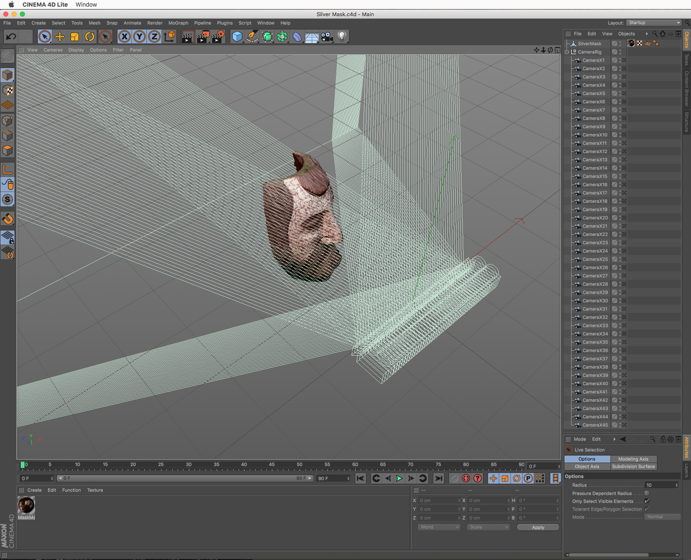
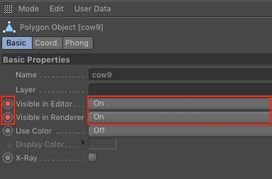
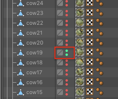
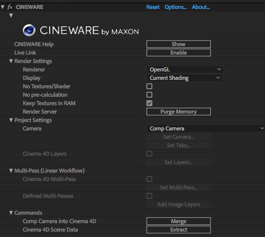
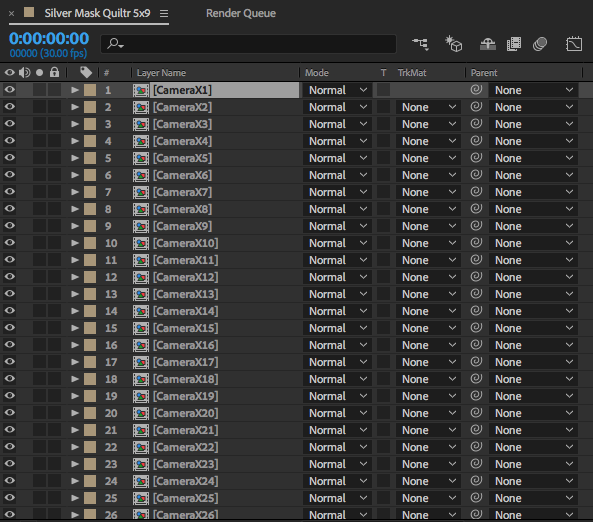
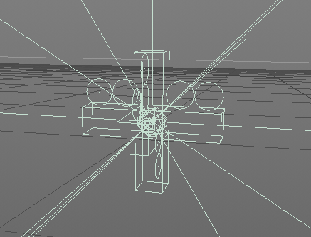
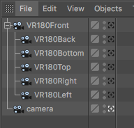
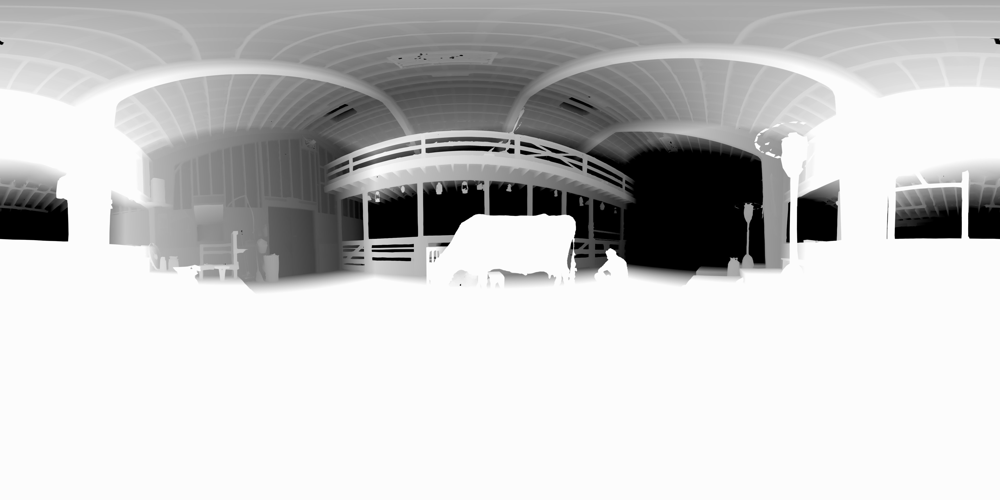

# Lightfielder for After Effects - 2019-10-17 #

---

## Support ##

Created By: Andrew Hazelden  
E-Mail: [andrew@andrewhazelden.com](mailto:andrew@andrewhazelden.com)  
Web: [http://www.andrewhazelden.com](http://www.andrewhazelden.com)  

### Adobe After Effects + C4D Lite ###

[Adobe After Effects CC](https://www.adobe.com/products/aftereffects.html) ships with a built-in copy of [Cinema4D](https://www.maxon.net/en-us/) Lite and the [Cineware plugin](https://www.maxon.net/en-us/products/cineware-for-after-effects/). With the right insight and knowledge, this combo makes it possible to render out OBJ models as mesh sequences and lightfields inside of a stock copy of After Effects that every single Adobe Creative Cloud Subscriber has on their desktop computer.

You start by manually importing your sequence of OBJ models into C4D Lite. Then you edit each of the OBJ materials to build the scene you want with "unlit" surface material settings activated, if required. Using per-frame visibility toggling on the OBJ sequence imported meshes in C4D Lite you get a hackey but fully workable implementation of volumetric video sequence loading and playback in CC 2019. 

**If you have C4D scripting skills you can automating the process to make it less painful to setup. :)**

This view shows the two controls you need to keyframe visibility animated in C4D Lite for each of the models in your OBJ mesh sequence.

When you scrub the C4D Lite timeline play controls you will see two small green "LED" like lights blink and chase upwards/downwards as they to show you which mesh from the mesh sequence is visible on the current frame of the sequence.

Once you have your basic OBJ mesh sequence rendering happening in After Effects + Cineware, the next step is to create a custom DIY lightfield rendering camera rig in C4D Lite. You can then render out volumetric content inside of After Effects with as many pre-comps as you want to output each of the multi-view lightfield footage clips you have in your rig, and to also do stereo convergence on each of the pre-comped Cineware camera views. AE based expressions are super powerful for this process.

*If you are doing this DIY volumetric camera rig approach on your own, the AE "[ExpressionUniverslizer 3](https://aescripts.com/expressionuniversalizer/)" JSX script is essential if you want to share your scene file with other artists around the world who use non-english versions of AE.*

Using an AE based approach to render volumetric 3D content is not going to win any speed awards since it gets a little bit pokey on the render times. BUT the exciting thing is that your copy of After Effects CC 2019 DOES work as a volumetric lightfield rendering environment.

Cineware rendered multi-view imagery can be formatted into a unified lightfield "quilted" layout simply by bringing in each of the pre-comps and then stacking them into a tiled texture atlas  view. **AE based expressions could be for this step to instantly position all the pre-comp elements where they need to go.**

## Immersive 360VR Depthmap Rendering in AE ###

The Cineware plugin that runs inside of a After Effects CC 2019 session is now able to render out RGB and depthmap passes too now which is quite cool. This allows for 6DOF Volumetric RGBD workflows to happen. And if you wanted to, you could even make a 5 view (hemi-cuve) or six view (full cubic) cubic 90° FOV camera rig and make a cubic panorama in your volumetric scenes.

C4D Lite viewport showing a 5 camera (hemi-cube) rig for fisheye output:

C4D Lite with the parented 90° FOV camera hierarchy:

The Adobe AE CC 2019 "VR Converter" effect can then take your cubemap views and generate fisheye 180° or LatLong 360x180° color and depthmap rendered movies.

This would allow for 6DOF Depthmap omni-stereo playback to happen on a modern HMD, which expands you options if you wanted to dabble with lightfield based output from After Effects.

## Linear Camera Array Multi-view Stereo Convergence ##

You would need to add one more level of pre-comps to this workflow if you wanted to do stereo convergence (zero parallax distance) view alignments on each of the rendered lightfield frames in AE. This is due to the AE Cineware plugin's need to render an image to 100% of the comp's fame size in AE.

Since AE doesn't allow for camera filmback horizontal shift offsets with the Cineware plugin, you'd need to over-render each camera view frame size on the horizontal axis. Then for each of the Cineware rendered camera view pre-comps, you would need do a post-render view converge which is basically a pre-comp view crop effect, and a 2D horizontal axis pan that is done on the image in the 2D pixel domain.

## Example Comps ##

### `45_camera_array_ae_project` ###

This example AE comp is a 45 linear camera array rendering example that uses C4D Lite and Cineware. The 45 rendered views are placed in a tiled grid layout. No view convergence is done to try and keep the project semi-fast-ish at rendering.
