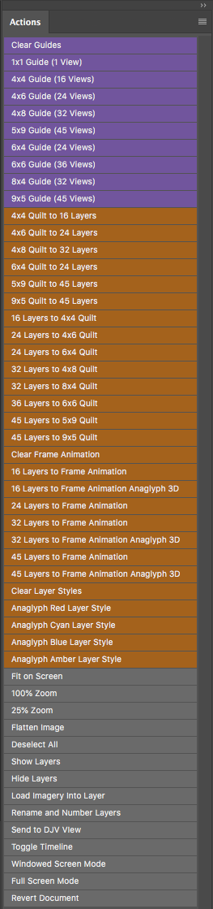
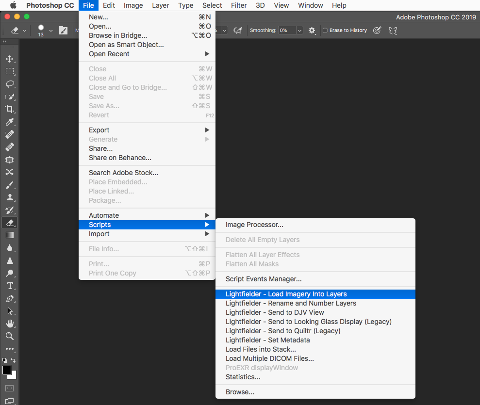

# Lightfielder for Photoshop - 2019-10-17 #

---

## Support ##

Created By: Andrew Hazelden  
E-Mail: [andrew@andrewhazelden.com](mailto:andrew@andrewhazelden.com)  
Web: [http://www.andrewhazelden.com](http://www.andrewhazelden.com)  

## Photoshop Install ##

**Step 1.**

Install the .jsx scripts files from the `Presets/Scripts` folder to:

`C:\Program Files\Adobe\Adobe Photoshop CC <Version Number>\Presets\Scripts\`

`/Applications/Adobe Photoshop <Version Number>/Presets/Scripts`

Install the .atn actions files from the `Presets/Actions` folder to:

`C:\Program Files\Adobe\Adobe Photoshop CC <Version Number>\Presets\Actions\`

`/Applications/Adobe Photoshop <Version Number>/Presets/Actions`

Install the `Lightfielder.asl` style file from the `Presets/Styles` folder to:

`C:\Program Files\Adobe\Adobe Photoshop CC <Version Number>\Presets\Styles\`

`/Applications/Adobe Photoshop <Version Number>/Presets/Styles`

**Step 2.** Load the .atn actions in Photoshop by showing the Actions tab using the "Window > Action" menu.

In the Actions tab use the "humburger menu" stacked icon to access the extra options. Select the "Lightfielder Guides", "Lightfielder Quilt", and the "Lightfielder Workflow" actions.

**Step 3.** Load the .asl styles in Photoshop by showing the Styles tab using the "Window > Styles" menu.

In the Styles tab use the "humburger menu" stacked icon to access the extra options. Select the "Lightfielder" item. If you click "OK" all the existing styles will be cleared out from the Styles tab. Alternatively, you can append these styles to the existing entries you have.

**Step 4.** Restart Photoshop if it is currently running. You are now ready to use the Lightfielder tools in Photoshop.

**Step 5.** You may want to customize the Lightfielder jsx scripts using a programmer's text editor like Notepad++ (Windows), or BBEdit (macOS).

## Screenshots ##

### Photoshop Actions ###

### Photoshop Scripts ###

## Lightfielder Actions ##

The following actions are provided by Lightfielder for Photoshop:

### Lightfielder Guides ###

- Clear Guides
- 1x1 Guide (1 View)
- 4x4 Guide (16 View)
- 4x6 Guide (24 View)
- 4x8 Guide (32 View)
- 5x9 Guide (45 View)
- 6x4 Guide (24 View)
- 6x6 Guide (36 View)
- 8x4 Guide (32 View)
- 9x5 Guide (45 View)

### Lightfielder Quilt ###

- 4x4 Quilt to 16 Layers
- 4x6 Quilt to 24 Layers
- 6x4 Quilt to 32 Layers
- 5x9 Quilt to 24 Layers
- 9x5 Quilt to 45 Layers
- 9x5 Quilt to 45 Layers
- 16 Layers to 4x4 Quilt
- 24 Layers to 4x6 Quilt
- 24 Layers to 6x4 Quilt
- 32 Layers to 4x8 Quilt
- 32 Layers to 8x4 Quilt
- 36 Layers to 6x6 Quilt
- 45 Layers to 5x9 Quilt
- 45 Layers to 9x5 Quilt
- Clear Frame Animation
- 16 Layers to Frame Animation
- 16 Layers to Frame Animation Anaglyph 3D
- 24 Layers to Frame Animation
- 32 Layers to Frame Animation
- 32 Layers to Frame Animation Anaglyph 3D
- 45 Layers to Frame Animation
- 45 Layers to Frame Animation Anaglyph 3D
- Clear Layer Styles
- Anaglyph Red Layer Style
- Anaglyph Cyan Layer Style
- Anaglyph Blue Layer Style
- Anaglyph Amber Layer Style

### Lightfielder Workflow ###

- Fit on Screen
- 100% Zoom
- 25% Zoom
- Flatten Image
- Deselect Image
- Show Layers
- Hide Layers
- Load Imagery into Layer
- Rename and Number Layers
- Send to DJV View
- Toggle Timeline
- Windowed Screen Mode
- Full Screen Mode
- Revert Document

## Lightfielder Scripts ##

The following JSX scripts are provided by Lightfielder for Photoshop:

- Lightfielder - Load Imagery Into Layers.jsx
- Lightfielder - Rename and Number Layers.jsx
- Lightfielder - Send to DJV View.jsx
- Lightfielder - Send to Looking Glass Display (Legacy).jsx
- Lightfielder - Send to Quiltr (Legacy).jsx
- Lightfielder - Set Metadata.jsx

**Note:** *The two JSX scripts marked with `(Legacy)` are included as examples that you can pick apart for learning purposes. But TBH they will likely be of little use to most new Looking Glass users who are just getting started in 2019 and beyond since the CLI (command-line) tools they relied on have been discontinued.*

