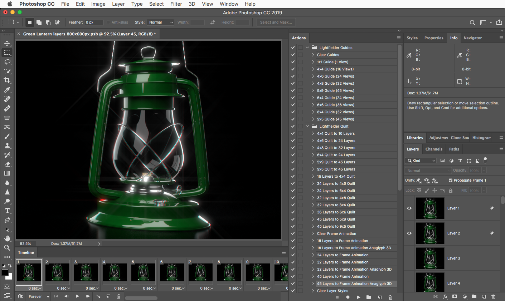

# Lightfielder for Photoshop - 2019-11-16 #

---

## Support ##

Created By: Andrew Hazelden  
E-Mail: [andrew@andrewhazelden.com](mailto:andrew@andrewhazelden.com)  
Web: [http://www.andrewhazelden.com](http://www.andrewhazelden.com)  

## Overview ##

Lightfielder Suite is an open-source set of post-production tools that help make volumetric production easier by providing a set of consistent tools that run inside of the leading DCC apps.

The Photoshop version of Lightfielder makes it easier to work with quilted multi-view media by providing a set of Photoshop Actions that automate common tasks.

Creating "Looking Glass Display" formatted quilts is fast and easy:

And you can also use the `N Layers to Frame Animation Anaglyph 3D` actions to playback a stereoscopic 3D preview via anaglyph red/cyan glasses of your multi-view lightfields. The timeline scrubbing is done with the Photoshop "Timeline" palette's playback controls.

## Photoshop Install ##

### Step 1. ###

- Install the .jsx scripts files from the `Presets/Scripts` folder to:

	`C:\Program Files\Adobe\Adobe Photoshop CC <Version Number>\Presets\Scripts\`

	`/Applications/Adobe Photoshop <Version Number>/Presets/Scripts`

- Install the .atn actions files from the `Presets/Actions` folder to:

	`C:\Program Files\Adobe\Adobe Photoshop CC <Version Number>\Presets\Actions\`

	`/Applications/Adobe Photoshop <Version Number>/Presets/Actions`

- Install the `Lightfielder.asl` style file from the `Presets/Styles` folder to:

	`C:\Program Files\Adobe\Adobe Photoshop CC <Version Number>\Presets\Styles\`

	`/Applications/Adobe Photoshop <Version Number>/Presets/Styles`

### Step 2. ###

Load the .atn actions in Photoshop by showing the Actions tab using the "Window > Action" menu.

In the Actions tab use the "humburger menu" stacked icon to access the extra options. Select the "Lightfielder Guides", "Lightfielder Quilt", and the "Lightfielder Workflow" actions.

### Step 3. ###

Load the .asl styles in Photoshop by showing the Styles tab using the "Window > Styles" menu.

In the Styles tab use the "humburger menu" stacked icon to access the extra options. Select the "Lightfielder" item. If you click "OK" all the existing styles will be cleared out from the Styles tab. Alternatively, you can append these styles to the existing entries you have.

### Step 4. ###

Restart Photoshop if it is currently running. You are now ready to use the Lightfielder tools in Photoshop.

### Step 5. ###

You may want to customize the Lightfielder jsx scripts using a programmer's text editor like BBEdit (macOS), or Notepad++ (Windows).

# Lightfielder Actions List #

The following actions are provided by Lightfielder for Photoshop:

## Photoshop Actions ##

## Lightfielder Guides ##

- Clear Guides
- 1x1 Guide (1 View)
- 4x4 Guide (16 View)
- 4x6 Guide (24 View)
- 4x8 Guide (32 View)
- 5x9 Guide (45 View)
- 6x4 Guide (24 View)
- 6x6 Guide (36 View)
- 8x4 Guide (32 View)
- 9x5 Guide (45 View)

## Lightfielder Quilt ##

- 4x4 Quilt to 16 Layers
- 4x6 Quilt to 24 Layers
- 6x4 Quilt to 32 Layers
- 5x9 Quilt to 24 Layers
- 9x5 Quilt to 45 Layers
- 9x5 Quilt to 45 Layers
- 16 Layers to 4x4 Quilt
- 24 Layers to 4x6 Quilt
- 24 Layers to 6x4 Quilt
- 32 Layers to 4x8 Quilt
- 32 Layers to 8x4 Quilt
- 36 Layers to 6x6 Quilt
- 45 Layers to 5x9 Quilt
- 45 Layers to 9x5 Quilt
- Clear Frame Animation
- 16 Layers to Frame Animation
- 16 Layers to Frame Animation Anaglyph 3D
- 24 Layers to Frame Animation
- 32 Layers to Frame Animation
- 32 Layers to Frame Animation Anaglyph 3D
- 45 Layers to Frame Animation
- 45 Layers to Frame Animation Anaglyph 3D
- Clear Layer Styles
- Anaglyph Red Layer Style
- Anaglyph Cyan Layer Style
- Anaglyph Blue Layer Style
- Anaglyph Amber Layer Style

## Lightfielder Workflow ##

- Fit on Screen
- 100% Zoom
- 25% Zoom
- Flatten Image
- Deselect Image
- Show Layers
- Hide Layers
- Load Imagery into Layer
- Rename and Number Layers
- Send to DJV View
- Toggle Timeline
- Windowed Screen Mode
- Full Screen Mode
- Revert Document

## Lightfielder Action Descriptions ##

### Lightfielder Guides ###

The "Clear Guides" action removes all alignment guides from the Photoshop document.

The `1x1 Guide (1 View)` to `9x5 Guide (45 View)` actions all add alignment guides to the Photoshop document that make it easier to select specific image views when snapping is enabled using the `View > Snapping` menu item.

### Lightfielder Quilt ###

The `4x4 Quilt to 16 Layers` to `9x5 Quilt to 45 Layers` actions will break down a flattened image that has a tiled grid of lightfield views. These views are copied into a series of automatically named and numbered Photoshop Layers that are named in the Layer palette "Layer 1", "Layer 2", "Layer 3", etc...

The `16 Layers to 4x4 Quilt` to `45 Layers to 9x5 Quilt` actions will take a series of Photoshop layers named "Layer 1", "Layer 2", "Layer 3", etc... and turn them into a tiled texture atlas style grid layout of quilted images.

The `Clear Frame Animation` action removes all frame based animation elements from the Photoshop Timeline palette view.

The `16 Layers to Frame Animation` to `45 Layers to Frame Animation` actions turn a series of Photoshop Layers that are named "Layer 1", "Layer 2", "Layer 3", etc... into a Photoshop Timeline palette view based animated sequence. This allows you to do a flipbook style view of your lightfield sequence.

The `16 Layers to Frame Animation Anaglyph 3D`, `32 Layers to Frame Animation Anaglyph 3D`, and `45 Layers to Frame Animation Anaglyph 3D` actions turn a series of Photoshop Layers that are named "Layer 1", "Layer 2", "Layer 3", etc... into a Photoshop Timeline palette view based anaglyph stereoscopic 3D animated sequence. This allows you to do a flipbook style view of your lightfield sequence. This action works by applying a red channel based layer style to the left eye view, and a cyan (blue/green) channel based layer style to the right eye view which are created by mixing together the current frame, and the next frame in the timeline view images.

The `Clear Layer Styles` action removes all of the red/cyan based layer style effects that are used when creating Anaglyph 3D based timeline effects.

The `Anaglyph Red Layer Style`, `Anaglyph Cyan Layer Style`, `Anaglyph Blue Layer Style`, and `Anaglyph Amber Layer Style` actions are used to apply color channel based layer style effects to right or left eye stereo views so you can view them in stereo 3D using Anaglyph glasses.

### Lightfielder Workflow ###

The `Fit on Screen` action will zoom out on the current Photoshop document so the full image is visible. This is handy if you are creating 4K - 14K (vertical resolution) quilted images that are far larger then your monitor can show at native resolution.

The `100% Zoom` action zooms the view to the monitor's 1:1 native resolution at 100% zoom scale. This allows you to inspect an individual lightfield camera view frame to look for details.

The `25% Zoom` action zooms the view to one quarter of the monitor's native resolution at 25% zoom scale. This allows you to fit a few lightfield camera view frames onscreen at once to look for changes in details across several images.

The `Flatten Image` action will merge all of the visible layers into one image and the layer name will become "background". This removes transparency and alpha channels from the image. You would typically use this action once you've created a finished quilted view and are preparing to export a JPEG based image to share on the web.

The `Deselect Image` action will clear all of the Layers palette selections you might have, and also clear any image view selections you have done with the rectangular selection or lasso tools.

The `Show Layers` action turns on the visibility eye icon for all layers in the Photoshop Layers palette. This is a lot faster then manually having to toggle the state of 45 layers by hand if you were working with a 9x5 lightfield quilt.

The `Hide Layers` action turns off the visibility eye icon for all layers in the Photoshop Layers palette. This is a lot faster then manually having to toggle the state of 45 layers by hand if you were working with a 9x5 lightfield quilt.

The `Load Imagery into Layer` action runs the `Lightfielder - Load Imagery Into Layers.jsx` script which is used to import a folder of imagery into layers in the Photoshop Layers palette. These imported layers come in with the image extension applied on the end of the layer name.

**Note** *The "Rename and Number Layers" script cleans up the automatic layer names that are created when media is imported via the "Load Imagery Into Layers" script since those layers have the image filetype extension present like "Layer 1.exr".**

The `Rename and Number Layers` action will rename all the images in your Photoshop Layers palette so they are sequentially numbered and given a new name like "Layer 1" to "Layer 45". The Lightfielder "N Layers to NxN Quilt" actions require the images loaded in the Photoshop Layers palette to be named like "Layer 1" to "Layer 45".

The `Send to DJV View` action runs the `Lightfielder - Send to DJV View.jsx` script. It allows you to quickly view the current Photoshop image document in the external [DJV View](http://djv.sourceforge.net/) image viewer.

**Note:** *It's important to know you will have to edit the `Lightfielder - Send to DJV View.jsx` script in a programmer's text editor like BBedit (macOS) or Notepad++ (Windows) so the .jsx script knows which version of DJV View you have installed and what that executable program's filename is on disk.*

The `Toogle Timeline` action will hide/show the Photoshop Timeline palette that is used to create frame based animations. This view is needed to view the lightfield layer sequences that are created by the `16 Layers to Frame Animation` to `45 Layers to Frame Animation` actions, and the stereoscopic 3D layer sequences created using the `16 Layers to Frame Animation Anaglyph 3D`, `32 Layers to Frame Animation Anaglyph 3D`, and `45 Layers to Frame Animation Anaglyph 3D` actions.

The `Windowed Screen Mode` action switches Photoshop's document editing mode into a window based mode where the image editing happens in a floating document window, and the Photoshop menu bar, layer palettes, and toolbar are visible, too.

The `Full Screen Mode` action switches Photoshop's document editing mode into a full screen view wherethe image editing happens in a distraction free environment. The Photoshop menu bar, layer palettes, and toolbar are typically hidden but can be shown by pressing the TAB hotkey.

The `Revert Document` action will undo all of the unsaved edits you have done to an image. This is done by closing and then re-opening which reverts all changes back to the last saved state. If you have converted images between a quilt and layer mode this will get you back to where you started.

# Lightfielder Scripts #

## Photoshop Scripts ##

## Script Descriptions ##

The following JSX scripts are provided by Lightfielder for Photoshop:

- Lightfielder - Load Imagery Into Layers.jsx
- Lightfielder - Rename and Number Layers.jsx
- Lightfielder - Send to DJV View.jsx
- Lightfielder - Send to Looking Glass Display (Legacy).jsx
- Lightfielder - Send to Quiltr (Legacy).jsx
- Lightfielder - Set Metadata.jsx

**Note:** *The two JSX scripts marked with `(Legacy)` are included as examples that you can pick apart for learning purposes. But TBH they will likely be of little use to most new Looking Glass users who are just getting started in 2019 and beyond since the CLI (command-line) tools they relied on have been discontinued.*

### Load Imagery Into Layers ###

The `Lightfielder - Load Imagery Into Layers.jsx` script can be used to load an image sequence into Photoshop Layers.

**Note** *The "Rename and Number Layers" script cleans up the automatic layer names that are created when media is imported via the "Load Imagery Into Layers" script since those layers have the image filetype extension present like "Layer 1.exr".**

#### Frame Numbering ####

If your numbered image sequence lacks leading zero digit based frame padding on the frame number element, you can fix the ordering of the frames using the "Sort By Name" button in the Load Layers dialog:

### Rename and Number Layers ###

The `Lightfielder - Rename and Number Layers.jsx` script will rename all the images in your Photoshop Layers palette so they are sequentially numbered and given a new name like "Layer 1" to "Layer 45". The Lightfielder "N Layers to NxN Quilt" actions require the images loaded in the Photoshop Layers palette to be named like "Layer 1" to "Layer 45".

**Note** *The "Rename and Number Layers" script cleans up the automatic layer names that are created when media is imported via the "Load Imagery Into Layers" script since those layers have the image filetype extension present like "Layer 1.exr".**

### Send to DJV View ###

The `Lightfielder - Send to DJV View.jsx` script allows you to quickly view the current Photoshop image document in the external [DJV View](http://djv.sourceforge.net/) image viewer.

**Note:** *It's important to know you will have to edit the `Lightfielder - Send to DJV View.jsx` script so it knows which version of DJV View you have installed and what that executable program's filename is on disk.*
