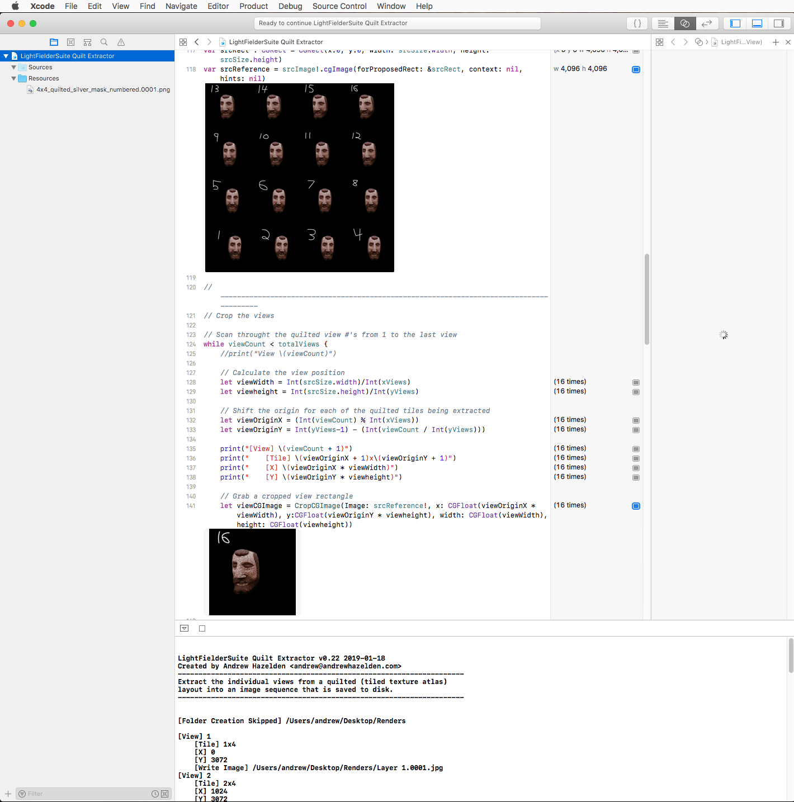

# Lightfielder for Swift - 2019-11-16 #

---

## Support ##

Created By: Andrew Hazelden  
E-Mail: [andrew@andrewhazelden.com](mailto:andrew@andrewhazelden.com)  
Web: [http://www.andrewhazelden.com](http://www.andrewhazelden.com)  

## Install and Usage ##

**Step 1.** Install Apple Xcode v10.1+ for macOS.

**Step 2.** Run the "LightFielderSuite Quilt Extractor.playground" example in Xcode.

**Step 3.** You may want to customize the Swift playground example's source code using Xcode.

## LightFielderSuite Quilt Extractor ##

This Swift Playground example extracts the individual views from a quilted 4x4 (tiled texture atlas) layout into an image sequence that is saved to disk.

Rendered images will be extracted from the quilted view source image, and the results will be saved as individual frames to a newly created `$HOME/Desktop/Renders/` folder.

**Note** *If you change the number of quilted tiled views in the source image to a non 1:1 aspect ratio grid you will have to revise some of the source code.*

